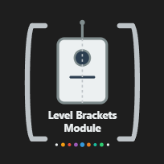

# AzerothCore Module: Bot Level Brackets

  

> **Disclaimer:** This module requires the [Playerbots module](https://github.com/liyunfan1223/mod-playerbots). Please ensure that the Playerbots module is installed and running before using this module.

Overview
--------
The Bot Level Brackets module for AzerothCore ensures an even spread of player bots across configurable level ranges (brackets). It periodically monitors bot levels and automatically adjusts them by transferring bots from overpopulated brackets to those with a deficit. During adjustments, bots are run through the normal Playerbots Randomize function, clearing and restoring them based on their new level. Bots that are not immediately safe for level reset (for example, those in combat or engaged in other activities) are flagged for pending adjustment and processed later when they become safe. Additionally, Death Knight bots are safeguarded to never be assigned a level below 55.

Features
--------
- **Configurable Faction-Specific Level Brackets:**  
  Define level brackets for Alliance and Horde bots with configurable lower and upper bounds.
- **Desired Percentage Distribution:**  
  Specify a desired percentage for bots in each bracket. The percentages for each faction must sum to 100.
- **Dynamic Bot Adjustment:**  
  Bots in overpopulated brackets are adjusted to a random level within a bracket with a deficit.
- **Death Knight Level Safeguard:**  
  Death Knight bots are enforced a minimum level of 55.
- **Guild Bot Exclusion:**  
  When enabled, bots that are in a guild with at least one real (non-bot) player are excluded from bot bracket calculations and will not be adjusted. This feature now uses persistent database tracking to work for both online and offline real players.
- **Friend List Exclusion:**  
  When enabled, bots that are on real players' friend lists are excluded from level bracket adjustments.
- **Dynamic Distribution:**  
  Optionally enable dynamic recalculation of bot distribution percentages based on the number of non-bot players present in each bracket.
- **Sync Factions Bracket:** 
  Requires Dynamic Distribution to be on. Optionally enable synchronized bracket and weighting logic between Alliance and Horde. When enabled, both bracket range definitions must match exactly for both factions and real player activity from either faction influences bot bracket distribution for both factions.
- **Debug Modes:**  
  Full and Lite debug modes provide detailed logging for troubleshooting and monitoring bot adjustments.

Minimum and Maximum Bot Level Support
----------------------------------------
This module supports setting minimum and maximum levels for random bots via Playerbots options:
- **AiPlayerbot.RandomBotMinLevel:** Default is 1.
- **AiPlayerbot.RandomBotMaxLevel:** Default is 80.

> **Warning:** If you configure the maximum bot level to a value below 55, ensure that Death Knight bots are disabled.

Installation
------------
1. **Clone the Module**  
   Ensure the AzerothCore Playerbots fork is installed and running. Clone the module into your AzerothCore modules directory:
   
       cd /path/to/azerothcore/modules
       git clone https://github.com/DustinHendrickson/mod-player-bot-level-brackets.git

2. **Recompile AzerothCore**  
   Rebuild the project with the new module:
   
       cd /path/to/azerothcore
       mkdir build && cd build
       cmake ..
       make -j$(nproc)

3. **Configure the Module**  
   Rename the configuration file:
   
       mv /path/to/azerothcore/modules/mod_player_bot_level_brackets.conf.dist /path/to/azerothcore/modules/mod_player_bot_level_brackets.conf

4. **Restart the Server**  
   Launch the world server:
   
       ./worldserver

Configuration Options
---------------------
Customize the module’s behavior by editing the `mod_player_bot_level_brackets.conf` file. The configuration options are split into global settings and faction-specific level bracket settings.

### Global Settings

Setting                                      | Description                                                                                                                      | Default | Valid Values
---------------------------------------------|----------------------------------------------------------------------------------------------------------------------------------|---------|--------------------
BotLevelBrackets.Enabled                     | Enables the module.                                                                                                              | 1       | 0 (off) / 1 (on)
BotLevelBrackets.FullDebugMode               | Enables full debug logging for the Bot Level Brackets module.                                                                    | 0       | 0 (off) / 1 (on)
BotLevelBrackets.LiteDebugMode               | Enables lite debug logging for the Bot Level Brackets module.                                                                    | 0       | 0 (off) / 1 (on)
BotLevelBrackets.CheckFrequency              | Frequency (in seconds) at which the bot level distribution check is performed.                                                  | 300     | Positive Integer
BotLevelBrackets.CheckFlaggedFrequency       | Frequency (in seconds) at which the bot level reset is performed for flagged bots that initially failed safety checks.             | 15      | Positive Integer
BotLevelBrackets.FlaggedProcessLimit         | Maximum number of flagged bots to process per pending level change step.                                                           | 5       | Positive Integer
BotLevelBrackets.Dynamic.UseDynamicDistribution | Enables dynamic bot distribution: when on, brackets with more real players get a higher share of bots in their level bracket, based on the weight below. | 0 | 0 (off) / 1 (on)
BotLevelBrackets.Dynamic.RealPlayerWeight | Controls how much bots "follow" real player activity when dynamic distribution is enabled. 0.0 = bots always spread evenly; 1.0 = minimal effect; 10.0 = heavy effect; higher values = more bots go where players are, but the effect is scaled. | 1.0 | ≥ 0.0 (float)
BotLevelBrackets.Dynamic.SyncFactions      | Enables synchronized brackets and weighting between Alliance and Horde factions when Dynamic Distribution is also enabled.                        | 0       | 0 (off) / 1 (on)
BotLevelBrackets.IgnoreFriendListed           | Ignores bots that are on real players' friend lists from any bracket calculations.                                              | 1       | 0 (off) / 1 (on)
BotLevelBrackets.IgnoreGuildBotsWithRealPlayers | Excludes bots in a guild with at least one real (non-bot) player from adjustments. Uses persistent database tracking for both online and offline real players. | 1       | 0 (disabled) / 1 (enabled)
BotLevelBrackets.GuildTrackerUpdateFrequency | Frequency (in seconds) at which the persistent guild tracker database is updated to track guilds with real players.           | 600     | Positive Integer
BotLevelBrackets.NumRanges                     | Number of level brackets used for bot distribution. Both factions must have the same number defined.                             | 9       | Positive Integer
BotLevelBrackets.ExcludeNames                  | Comma-separated list of case insensitive bot names to exclude from all bracket checks.                                                            |         | String

**IMPORTANT:** If you extend the number of brackets beyond the default 9, you must update both your `mod_player_bot_level_brackets.conf` file and the accompanying `mod_player_bot_level_brackets.conf.dist` file to include configuration lines for the additional ranges (e.g. Range10, Range11, etc.), ensuring that the sum of the Pct values remains 100.

### Alliance Level Brackets Configuration
*The percentages below must sum to 100.*

For each bracket, define:

- **BotLevelBrackets.Alliance.RangeX.Lower:**  
  The lower bound (inclusive) of bracket X.
  
- **BotLevelBrackets.Alliance.RangeX.Upper:**  
  The upper bound (inclusive) of bracket X.
  
- **BotLevelBrackets.Alliance.RangeX.Pct:**  
  The desired percentage of Alliance bots that should fall into bracket X.

**EXAMPLE:**  
The default configuration below defines 9 brackets:
- Range1 covers levels 1–9  
  `BotLevelBrackets.Alliance.Range1.Lower = 1`  
  `BotLevelBrackets.Alliance.Range1.Upper = 9`  
  `BotLevelBrackets.Alliance.Range1.Pct   = 12`
- Range2 covers levels 10–19  
  `BotLevelBrackets.Alliance.Range2.Lower = 10`  
  `BotLevelBrackets.Alliance.Range2.Upper = 19`  
  `BotLevelBrackets.Alliance.Range2.Pct   = 11`
- Range3 covers levels 20–29  
  `BotLevelBrackets.Alliance.Range3.Lower = 20`  
  `BotLevelBrackets.Alliance.Range3.Upper = 29`  
  `BotLevelBrackets.Alliance.Range3.Pct   = 11`
- Range4 covers levels 30–39  
  `BotLevelBrackets.Alliance.Range4.Lower = 30`  
  `BotLevelBrackets.Alliance.Range4.Upper = 39`  
  `BotLevelBrackets.Alliance.Range4.Pct   = 11`
- Range5 covers levels 40–49  
  `BotLevelBrackets.Alliance.Range5.Lower = 40`  
  `BotLevelBrackets.Alliance.Range5.Upper = 49`  
  `BotLevelBrackets.Alliance.Range5.Pct   = 11`
- Range6 covers levels 50–59  
  `BotLevelBrackets.Alliance.Range6.Lower = 50`  
  `BotLevelBrackets.Alliance.Range6.Upper = 59`  
  `BotLevelBrackets.Alliance.Range6.Pct   = 11`
- Range7 covers levels 60–69  
  `BotLevelBrackets.Alliance.Range7.Lower = 60`  
  `BotLevelBrackets.Alliance.Range7.Upper = 69`  
  `BotLevelBrackets.Alliance.Range7.Pct   = 11`
- Range8 covers levels 70–79  
  `BotLevelBrackets.Alliance.Range8.Lower = 70`  
  `BotLevelBrackets.Alliance.Range8.Upper = 79`  
  `BotLevelBrackets.Alliance.Range8.Pct   = 11`
- Range9 covers level 80 only  
  `BotLevelBrackets.Alliance.Range9.Lower = 80`  
  `BotLevelBrackets.Alliance.Range9.Upper = 80`  
  `BotLevelBrackets.Alliance.Range9.Pct   = 11`

To isolate a specific level (e.g., level 60) into its own bracket, set the Lower and Upper for that range to the same value (e.g., 60) and adjust the adjacent ranges accordingly.

### Horde Level Brackets Configuration
*The percentages below must sum to 100.*

For each bracket, define:

- **BotLevelBrackets.Horde.RangeX.Lower:**  
  The lower bound (inclusive) of bracket X.
  
- **BotLevelBrackets.Horde.RangeX.Upper:**  
  The upper bound (inclusive) of bracket X.
  
- **BotLevelBrackets.Horde.RangeX.Pct:**  
  The desired percentage of Horde bots that should fall into bracket X.

**EXAMPLE:**  
The default configuration below defines 9 brackets:
- Range1 covers levels 1–9  
  `BotLevelBrackets.Horde.Range1.Lower = 1`  
  `BotLevelBrackets.Horde.Range1.Upper = 9`  
  `BotLevelBrackets.Horde.Range1.Pct   = 12`
- Range2 covers levels 10–19  
  `BotLevelBrackets.Horde.Range2.Lower = 10`  
  `BotLevelBrackets.Horde.Range2.Upper = 19`  
  `BotLevelBrackets.Horde.Range2.Pct   = 11`
- Range3 covers levels 20–29  
  `BotLevelBrackets.Horde.Range3.Lower = 20`  
  `BotLevelBrackets.Horde.Range3.Upper = 29`  
  `BotLevelBrackets.Horde.Range3.Pct   = 11`
- Range4 covers levels 30–39  
  `BotLevelBrackets.Horde.Range4.Lower = 30`  
  `BotLevelBrackets.Horde.Range4.Upper = 39`  
  `BotLevelBrackets.Horde.Range4.Pct   = 11`
- Range5 covers levels 40–49  
  `BotLevelBrackets.Horde.Range5.Lower = 40`  
  `BotLevelBrackets.Horde.Range5.Upper = 49`  
  `BotLevelBrackets.Horde.Range5.Pct   = 11`
- Range6 covers levels 50–59  
  `BotLevelBrackets.Horde.Range6.Lower = 50`  
  `BotLevelBrackets.Horde.Range6.Upper = 59`  
  `BotLevelBrackets.Horde.Range6.Pct   = 11`
- Range7 covers levels 60–69  
  `BotLevelBrackets.Horde.Range7.Lower = 60`  
  `BotLevelBrackets.Horde.Range7.Upper = 69`  
  `BotLevelBrackets.Horde.Range7.Pct   = 11`
- Range8 covers levels 70–79  
  `BotLevelBrackets.Horde.Range8.Lower = 70`  
  `BotLevelBrackets.Horde.Range8.Upper = 79`  
  `BotLevelBrackets.Horde.Range8.Pct   = 11`
- Range9 covers level 80 only  
  `BotLevelBrackets.Horde.Range9.Lower = 80`  
  `BotLevelBrackets.Horde.Range9.Upper = 80`  
  `BotLevelBrackets.Horde.Range9.Pct   = 11`

Debugging
---------
To enable detailed debug logging, update the configuration file with one of the following:

    BotLevelBrackets.FullDebugMode = 1
    BotLevelBrackets.LiteDebugMode = 1

Troubleshooting
---------------
> **Bots are not randomizing their levels within the range brackets.**  
> Ensure that in your `playerbots.conf` the option `AiPlayerbot.DisableRandomLevels` is set to false. Otherwise, bots will be reset to the fixed level specified in your Playerbots configuration.

License
-------
This module is released under the GNU GPL v2 license, consistent with AzerothCore's licensing model.

Contribution
------------
Created by Dustin Hendrickson.

Pull requests and issues are welcome. Please ensure that contributions adhere to AzerothCore's coding standards.
